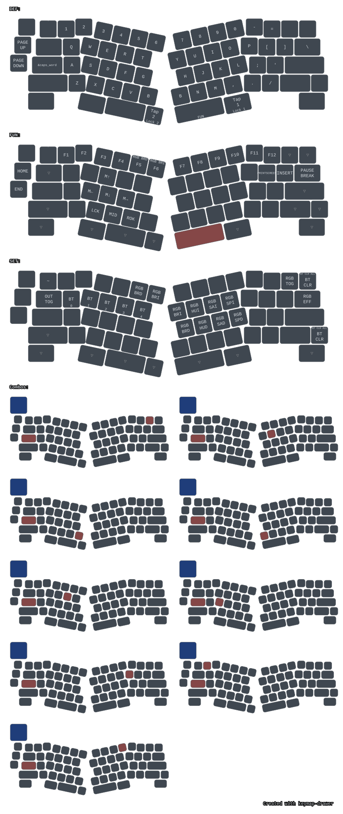
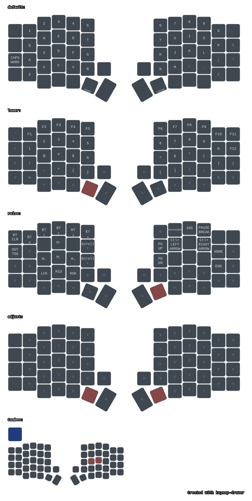
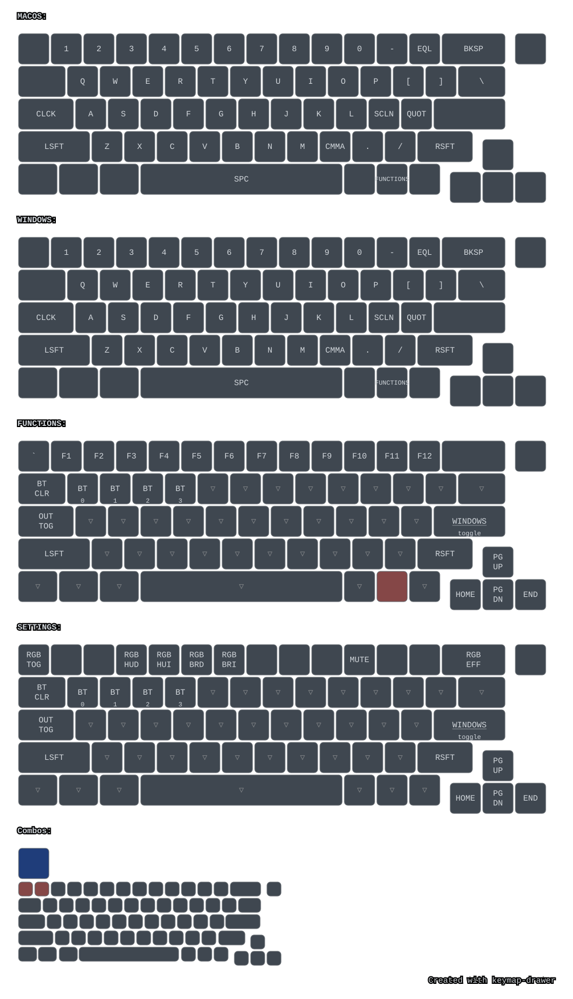

# ZMK user-config

Personal ZMK v0.3 user-config repository supporting multiple keyboards: **Geulis**, **Marvelous65** (Rev2, Ergo, Split), and **Sofle RGB v2.1**.

## Keyboards

| Keyboard | Type | Controller / MCU | Features | Build Command |
|---|---|---|---|---|
| **Geulis** | Alice (7×10) | Integrated nRF52840 | 3× Encoders, WS2812 RGB, OLED, ZMK Studio | `./docker/build.sh --studio --board geulis` |
| **Sofle RGB v2.1** | Split (6×12) | `nrfmicro_13` (nRF52840 + XTAL) | 2× Encoders, `nice!oled` (Bongo Cat WPM), Pointing / Mouse, ZMK Studio | `./docker/build.sh --studio --board nrfmicro_13 --shield "sofle_right nice_oled"` |
| **Marvelous65 Rev2** | 65% ANSI | Integrated nRF52840 | 1× Encoder, WS2812 RGB, OLED | `./docker/build.sh --regular --board marvelous65` |
| **Marvelous65 Ergo** | 65% Ergo | Integrated nRF52840 | 1× Encoder, Split B, WS2812 RGB, OLED | `./docker/build.sh --regular --board marvelous65_ergo` |
| **Marvelous65 Split** | True Split 65% | `nrfmicro_13` (nRF52840) | 2× Encoders, WS2812 RGB, OLED | `./docker/build.sh --regular --shield marvelous65_split_right` |

---

## Visual Keymaps

Keymaps are automatically parsed and rendered into vector SVGs on push by CI via `keymap-drawer`.

| Geulis (Alice) | Sofle RGB v2.1 | Marvelous65 |
|:---:|:---:|:---:|
| [](keymap-drawer/geulis.svg) | [](keymap-drawer/sofle.svg) | [](keymap-drawer/marvelous65.svg) |

---

## Repository Layout

```
.
├── build.yaml                # GitHub Actions CI build matrix
├── config/
│   ├── west.yml              # West manifest (ZMK @ v0.3 + zmk-nice-oled)
│   ├── sofle.keymap          # Sofle keymap, custom behaviors, & layers
│   └── sofle.conf            # Sofle Kconfig (nice!oled, pointing, PM, sleep)
├── zephyr/module.yml         # Registers this repo as a Zephyr module
├── boards/
│   ├── arm/
│   │   ├── geulis/           # Geulis Alice (nRF52840) board definition
│   │   ├── marvelous65/      # Marvelous65 65% ANSI (nRF52840)
│   │   └── marvelous65_ergo/ # Marvelous65 Ergo (nRF52840)
│   └── shields/
│       └── marvelous65_split/# Marvelous65 split shields (left / right)
├── keymap-drawer/            # Rendered keymap SVGs, YAML, and config
├── docker/                   # Local containerized build toolchain
│   ├── Dockerfile            # Wraps zmk-build-arm:stable
│   ├── docker-compose.yml    # Docker Compose service with cache volume
│   └── build.sh              # Local build helper script
└── .github/workflows/
    ├── build.yml             # Automated CI firmware compilation & releases
    └── draw-keymaps.yml      # Automated keymap diagram generation
```

---

## Building the Firmware

Local builds run in an isolated Docker container with automated toolchain caching in a named volume (`zmk_workspace_cache`).

### 1. One-Time Setup

```bash
docker compose -f docker/docker-compose.yml build
```

### 2. Build Commands

#### Sofle RGB v2.1 (with `nice!oled` + Mouse Keys)
```bash
# Left half (Peripheral)
./docker/build.sh --board nrfmicro_13 --shield "sofle_left nice_oled"

# Right half (Central / USB - ZMK Studio enabled)
./docker/build.sh --studio --board nrfmicro_13 --shield "sofle_right nice_oled"

# Right half (Central / USB - Standard)
./docker/build.sh --board nrfmicro_13 --shield "sofle_right nice_oled"

# Factory reset firmware (if needing to re-pair or wipe persistent bonds)
./docker/build.sh --reset --board nrfmicro_13 --shield sofle_left
./docker/build.sh --reset --board nrfmicro_13 --shield sofle_right
```

#### Geulis (Alice)
```bash
./docker/build.sh --studio --board geulis       # ZMK Studio (Recommended)
./docker/build.sh --regular --board geulis      # Standard HID
./docker/build.sh --logging --board geulis      # USB CDC Logging
./docker/build.sh --reset --board geulis        # Factory Reset
```

#### Marvelous65 Variants
```bash
# Marvelous65 Rev2 & Ergo
./docker/build.sh --regular --board marvelous65
./docker/build.sh --regular --board marvelous65_ergo

# Marvelous65 Split
./docker/build.sh --regular --shield marvelous65_split_left
./docker/build.sh --regular --shield marvelous65_split_right
```

### 3. Flashing Firmware

1. Put the controller into bootloader mode by **double-tapping the reset button** (or pressing the `&bootloader` key / combo).
2. The board mounts as a mass-storage drive (e.g. `NICENANO` / `NRFMICRO` / `GEULIS`).
3. Drag and drop (or `cp`) the generated `.uf2` from `firmware/` to the mounted drive:
   ```bash
   cp firmware/nrfmicro_13-sofle_right-nice_oled-zmk-studio.uf2 /media/$USER/NRFMICRO/
   ```
4. The device reboots automatically into the new firmware.

> [!TIP]
> For split keyboards (Sofle & Marvelous65 Split), flash the **left half first**, then flash the **right (central) half**.

---

## Keyboard Details

### Sofle RGB v2.1

- **MCU:** `nrfmicro_13` (nRF52840 with populated 32.768 kHz external crystal).
- **Split Architecture:** Right half acts as central (USB / Bluetooth master), Left half acts as peripheral.
- **OLED Display (`nice!oled`):**
  - **Right Half (Central):** Bongo Cat typing speed (WPM) animation, live modifier icons (`Shift`, `Ctrl`, `Alt`, `GUI`), active layer name (`DEF`, `LWR`, `RSE`, `ADJ`), battery %, and Bluetooth profile.
  - **Left Half (Peripheral):** Animated Cat companion and sleep/idle artwork.
  - Standalone mode — no background host application required.
- **Rotary Encoders:**
  - `default` layer: Left = Volume (`C_VOL_UP`/`C_VOL_DN`), Right = Media Track (`C_NEXT`/`C_PREV`).
  - `lower` layer: Left = Page Navigation (`PG_UP`/`PG_DN`), Right = Word Navigation (`Ctrl+Right`/`Ctrl+Left`).
  - `raise` layer: Left = Mouse Vertical Scroll (`SCRL_UP`/`SCRL_DOWN`), Right = Mouse Horizontal Scroll (`SCRL_RIGHT`/`SCRL_LEFT`).
- **Mouse / Pointing (`CONFIG_ZMK_POINTING=y`):** Mouse cursor movement (`&mmv`), mouse clicks (`&mkp`), and scroll wheels (`&msc`) available directly on the `raise` layer.
- **Keymap Enhancements:**
  - `bspc_del`: Tap for Backspace, Shift/GUI for Delete (preserves `Ctrl+Alt+Del`).
  - `btick_code`: Tap for ``` ` ```, hold for Markdown code fence (` ``` ↵↵ ``` `).
  - `combo_jk_esc`: `J + K` pressed together fires `ESC` (base layer only, 40 ms timeout).
  - `caps_word`: Extended continue-list (`_`, `-`, Backspace, Delete) for smooth typo fixes and kebab-case typing.
  - Universal Media Play/Pause via `&kp C_PP`.

### Geulis

- **MCU:** Integrated nRF52840.
- **Layout:** Alice 7×10 matrix with 4 physical backspace/shift variants (`&layout0`–`&layout3`).
- **Hardware:** 3 EC11 rotary encoders, 18-LED WS2812 RGB underglow (SPI3), SSD1306 128×32 OLED (I2C0), battery sense (AIN2), `EXT_POWER` control (P1.09).
- **ZMK Studio:** Fully supported with live remapping and unlock combo (`<14 32>`, `<24 32>`).
- **Hardware Toggles:** Configured via `boards/arm/geulis/geulis_options.h` and `geulis_defconfig`.

### Marvelous65 (Rev2, Ergo, Split)

- **Rev2:** 65% ANSI layout, 1 EC11 encoder (top-right), WS2812 RGB underglow (14 LEDs), SSD1306 OLED.
- **Ergo:** 65% ergo layout with split B key across row 3/4.
- **Split:** True split 65% on `nrfmicro_13`, 2× encoders, RGB underglow, and OLED.

---

## Continuous Integration (CI)

- **Build Matrix (`build.yml`):** Runs on push to `v0.3-stable` / `main` and compiles all board and shield combinations in parallel. Releases UF2 artifacts to GitHub Releases.
- **Keymap Drawer (`draw-keymaps.yml`):** Automatically re-parses all `.keymap` files and updates the SVG diagrams in `keymap-drawer/`.

---

## License

SPDX-License-Identifier: MIT
